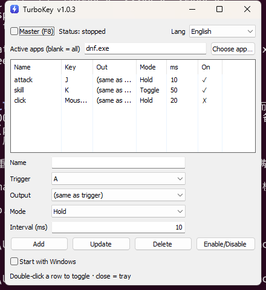

# TurboKey

[English](../README.md) · [简体中文](README.zh.md) · [繁體中文](README.zh-Hant.md) · [日本語](README.ja.md) · [한국어](README.ko.md) · [Español](README.es.md) · [Français](README.fr.md) · [Deutsch](README.de.md) · [Русский](README.ru.md) · [Português](README.pt.md) · [Italiano](README.it.md) · **العربية** · [עברית](README.he.md)

<div dir="rtl">

أداة خفيفة للنقر التلقائي للمفاتيح (rapid-fire / turbo) على Windows بواجهة رسومية أصلية. اربط مفتاحًا ليكرر نفسه — أو يكرر مفتاحًا آخر — تلقائيًا، إما أثناء الضغط المستمر أو كمفتاح تبديل تشغيل/إيقاف. لكل قاعدة فاصلها الزمني الخاص.

تعمل مع التطبيقات العادية ومع الألعاب: تُحقَن المفاتيح كرموز مسح (**scan codes**) للأجهزة عبر `SendInput` (لكي تقبلها ألعاب DirectInput)، ويُحتفظ بكل ضغطة لفترة قصيرة لتلتقطها الألعاب القائمة على الاستطلاع بشكل موثوق.

> Windows فقط. مبنية بـ Go + [lxn/walk](https://github.com/lxn/walk) (عناصر تحكم Win32 أصلية)، ملف تنفيذي واحد مكتفٍ ذاتيًا، دون أي بيئة تشغيل لتثبيتها.

</div>

<p align="center"></p>

<div dir="rtl">

## التنزيل

احصل على أحدث `turbokey.exe` من صفحة [Releases](../../releases). كل دفعة (push) إلى `main` تبني وتنشر تلقائيًا إصدارًا جديدًا مرقّمًا عبر GitHub Actions.

## الميزات

- لكل قاعدة: **مفتاح التشغيل**، **مفتاح الإخراج** (الافتراضي هو مفتاح التشغيل)، **الوضع**، **الفاصل** والتفعيل/التعطيل.
- مفاتيح لوحة المفاتيح **أو أزرار الفأرة** (يسار / يمين / وسط / X1 / X2) كمشغّل وإخراج.
- وضعان لكل قاعدة:
  - **ضغط مستمر** — يتكرر طالما أن مفتاح التشغيل مضغوط فعليًا.
  - **تبديل** — ضغطة تبدأ التكرار، والتالية توقفه.
- مفتاح رئيسي عام باختصار **F8**.
- يمكن اختياريًا قصر النقر السريع على تطبيقات محددة (بمطابقة اسم العملية)؛ فارغ = يعمل في كل مكان.
- **شريط النظام**: إغلاق النافذة يصغّرها إلى الشريط (تبقى الأداة تعمل). نقرة يسار على الأيقونة لاستعادتها؛ نقرة يمين لقائمة تُظهر النافذة، تبدّل المفتاح الرئيسي، أو تخرج.
- خيار **التشغيل مع Windows**، مسجَّل كمهمة مجدولة لتبدأ بصلاحيات مرتفعة عند تسجيل الدخول دون مطالبة UAC.
- تُحفظ القواعد في `config.json` بجوار الملف التنفيذي ويُعاد تحميلها عند البدء.
- واجهة مترجمة إلى 13 لغة (بما في ذلك العربية والعبرية من اليمين إلى اليسار بتخطيط معكوس بالكامل)، يُكتشف تلقائيًا من نظام التشغيل، مع مُحدِّد داخل التطبيق.
- تصفّي الأداة دخلها الاصطناعي الخاص، لذا لا تُعيد تشغيل نفسها أبدًا.

## كيف تعمل

- خطّاف لوحة مفاتيح منخفض المستوى `WH_KEYBOARD_LL` يكتشف ضغطاتك ويبتلع مفتاح التشغيل المُهيّأ، بحيث لا ترى اللعبة سوى النبضات المتكررة النظيفة.
- كل نبضة هي `ضغط المفتاح → إمساك ~30 مللي ثانية → رفع المفتاح`، تُرسَل مع `KEYEVENTF_SCANCODE`. الإمساك ضروري: تأخذ اللعبة القائمة على الاستطلاع عيّنة من حالة المفاتيح لكل إطار وقد تفوّت زوج ضغط/رفع يقع بين عيّنتين.
- توسَم الأحداث الاصطناعية عبر `dwExtraInfo`، فيتعرّف الخطّاف على مفاتيحه المحقونة ويمررها بدلًا من التعامل معها.

## المتطلبات

- Windows 10/11 (x64).
- **صلاحيات المسؤول.** يطلب الملف التنفيذي الرفع تلقائيًا (مطالبة UAC عند التشغيل). هذا ضروري لأن UIPI في Windows يمنع الدخل المحقون من عملية غير مرتفعة من الوصول إلى النوافذ المرتفعة — وكثير من الألعاب تعمل بصلاحيات مرتفعة.

## البناء

لا يتطلب CGO، لذا يمكن التصريف المتقاطع إلى Windows من Linux/WSL أو البناء أصليًا على Windows.

</div>

```sh
# Linux / WSL (تصريف متقاطع) أو Windows (Git Bash):
./build.sh
# -> turbokey.exe
```

<div dir="rtl">

يثبّت السكربت `rsrc` لتضمين بيان التطبيق (Common Controls v6، إدراك DPI، requireAdministrator)، ثم يشغّل `go build`. للبناء يدويًا:

</div>

```sh
go install github.com/akavel/rsrc@latest
rsrc -manifest cmd/turbokey/app.manifest -ico cmd/turbokey/icon.ico -arch amd64 -o cmd/turbokey/rsrc_windows_amd64.syso
GOOS=windows GOARCH=amd64 CGO_ENABLED=0 \
  go build -trimpath -ldflags "-H windowsgui -s -w" -o turbokey.exe ./cmd/turbokey
```

<div dir="rtl">

## بنية المشروع

</div>

```
cmd/turbokey/      نقطة الدخول (main) + بيان تطبيق Windows + الأيقونة
cmd/gen-icon/      مولّد الأيقونات وقت البناء (يولّد icon.ico / icon.png)
internal/keys/     جدول المفاتيح وأزرار الفأرة؛ تعيين الاسم <-> رمز المفتاح الافتراضي
internal/i18n/     ترجمة الواجهة؛ كتالوجات JSON مضمّنة (locales/)
internal/config/   نموذج القواعد وتحميل/حفظ config.json
internal/winput/   مغلّفات Win32: خطّافات لوحة المفاتيح والفأرة، SendInput، المقدمة
internal/engine/   محرك النقر السريع: توزيع الخطّافات، المفتاح الرئيسي، العمّال
internal/ui/       واجهة Win32 أصلية (lxn/walk)
internal/autostart/ مهمة مجدولة عند تسجيل الدخول (التشغيل مع Windows)
internal/buildinfo/ إصدار البناء، يُحقَن عبر -ldflags
```

<div dir="rtl">

## الاستخدام

1. شغّل `turbokey.exe` واقبل مطالبة UAC.
2. في المحرر، اختر **مفتاح التشغيل**، **مفتاح الإخراج** (الافتراضي = نفس التشغيل)، **الوضع**، و**الفاصل (مللي ثانية)**، ثم انقر **إضافة**.
3. لتغيير قاعدة، انقرها (تُحمَّل قيمها في المحرر)، عدّلها وانقر **تحديث**. النقر المزدوج على صف يفعّله/يعطّله؛ **حذف** يزيله.
4. اضغط **F8** (أو فعّل المفتاح الرئيسي) للتفعيل، ثم اضغط مفتاح التشغيل لإطلاق النقر. اضغط **F8** مرة أخرى عند الانتهاء.

ملاحظات:
- الفاصل هو الفجوة *بين* الضغطات؛ كل ضغطة تُمسك المفتاح أيضًا ~30 مللي ثانية، لذا السقف العملي نحو 25-30 ضغطة في الثانية. هذا أكثر من كافٍ لأي مهارة في اللعبة — الضغط أسرع لا يفيد، لأن اللعبة تأخذ عيّنات لكل إطار.
- أثناء تشغيل المفتاح الرئيسي، تُعترَض مفاتيح التشغيل المُهيّأة في **كل** التطبيقات، وليس الألعاب فقط. أطفئه (F8) عند عدم استخدامه.
- يُحجز F8 كاختصار رئيسي أثناء تشغيل الأداة.

## الإعدادات

`config.json` (يُنشأ بجوار الملف التنفيذي) قابل للقراءة البشرية:

</div>

```json
{
  "rules": [
    { "name": "attack", "trigger": "J", "output": "", "mode": "hold",   "interval": 10, "enabled": true },
    { "name": "skill",  "trigger": "K", "output": "", "mode": "toggle", "interval": 50, "enabled": false }
  ]
}
```

<div dir="rtl">

- `output: ""` يعني "نفس مفتاح التشغيل".
- `mode`: `"hold"` أو `"toggle"`.
- أسماء المفاتيح: `A`–`Z`، `0`–`9`، `F1`–`F12`، `Space`، `Enter`، `Esc`، `Tab`، `↑ ↓ ← →`، `Ctrl`، `Alt`، `Shift`، وأزرار الفأرة `Mouse Left`، `Mouse Right`، `Mouse Mid`، `Mouse X1`، `Mouse X2`. (هذه معرّفات محايدة لغويًا ولا تُترجَم، لذا تبقى الإعدادات صالحة عبر لغات الواجهة.)

## القصر على تطبيقات محددة

افتراضيًا، النقر السريع فعّال في كل تطبيق. لتقييده، املأ حقل "التطبيقات المفعّلة" باسم عملية واحدة أو أكثر (مثل `DNFGame.exe`، مفصولة بفواصل). عندها لا يعمل النقر السريع إلا بينما يكون أحد هذه التطبيقات في المقدمة؛ في غير ذلك تتصرّف مفاتيحك بشكل طبيعي.

لا تعرف اسم العملية؟ انقر **اختيار تطبيق…** واخترها من قائمة البرامج قيد التشغيل (تُعرَض بعنوان النافذة والملف التنفيذي). يعمل اختصار F8 الرئيسي دائمًا بغض النظر عن التطبيق النشط.

## اللغة

اختر اللغة من القائمة المنسدلة أعلى يمين النافذة. يُحفظ الاختيار في `config.json` ويُعاد تشغيل التطبيق لتطبيقه؛ "تلقائي" يتبع لغة واجهة Windows.

اللغات المضمّنة: English، 简体中文، 繁體中文، 日本語، 한국어، Español، Français، Deutsch، Русский، Português، Italiano، العربية، עברית.

اللغات من اليمين إلى اليسار (العربية، العبرية) تعكس تخطيط النافذة بالكامل عبر `WS_EX_LAYOUTRTL` (خاصية `RightToLeftLayout` في walk).

ترتيب التحليل: متغيّر البيئة `TURBOKEY_LANG` (`zh`/`en`)، ثم الاختيار المحفوظ، ثم لغة نظام التشغيل.

كتالوجات الرسائل هي JSON عادي تحت `internal/i18n/locales/`، مضمّنة بـ `go:embed`. لإضافة لغة، أسقِط `internal/i18n/locales/<code>.json` (انسخ `en.json` وترجم القيم) ثم أعد البناء.

## تحذيرات

- قد يؤدي خطّاف لوحة المفاتيح العام مع حقن الدخل إلى إنذارات كاذبة من مكافحات الفيروسات.
- تحظر بعض الألعاب عبر الإنترنت وحدات الماكرو/الأتمتة في شروط الخدمة، وقد تكتشف أنظمة مكافحة الغش الدخل الاصطناعي أو تحظره. استخدمها بمسؤولية وعلى مسؤوليتك الخاصة.

## الترخيص

[MIT](../LICENSE)

</div>
